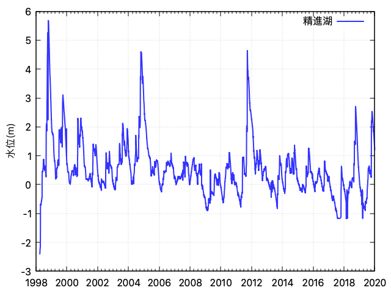

# fuji_gwl

富士五湖の水位

## コマンド
```bash
# xlsにエクセルデータをダウンロード
bash download.sh

# エクセルからCSVに変換
python excel2csv.py

# all_fix.csv: 明らかなデータの誤りがあるので修正した

# 精進湖の水位をグラフにする
gnuplot

> load "plot_level.plt"

```

## 図


## リンク
-   データ元： [山梨県 富士五湖の過去の水位](https://www.pref.yamanashi.jp/chisui/113_006.html) (CC-BY)
